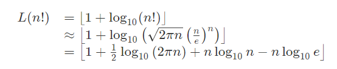

### <a href ="https://www.codewars.com/kata/59f34ec5a01431ab7600005a/python"> Factorial length</a>

In this Kata, you will implement a function ```count``` that takes an integer and returns the number of digits in ```factorial (n)```.

For example, ```count(5) = 3 ```, because ```5! = 120```, and ```120``` has ```3``` digits.

More examples in test cases.

Brute force is not possible. A little research will go a long way, as this is a well known series. 

Good luck!

#### Answer

Using the Stirling Approximation




```python
import math
def stirling(n):
    return int(1 + .5*math.log10(2*math.pi*n)+ n* math.log10(n)- n* math.log10(math.e))//1
def count(n):
    return stirling(n)
```

```
Test.assert_equals(count(5),3)
Test.assert_equals(count(50),65)
Test.assert_equals(count(500),1135)
Test.assert_equals(count(5000),16326)
Test.assert_equals(count(50000),213237)
Test.assert_equals(count(500000),2632342)
Test.assert_equals(count(5000000),31323382)
Test.assert_equals(count(50000000),363233781)
```


```python
print("count(5) = 3", count(5) == 3)
print("count(50) = 65", count(50) == 65)
print("count(500) = 1135", count(500) == 1135)
print("count(5000) = 16326", count(5000) == 16326)
print("count(50000) = 213237", count(50000) == 213237)
print("count(500000) = 2632342", count(500000) == 2632342)
print("count(5000000) = 31323382", count(5000000) == 31323382)
print("count(50000000) = 363233781", count(50000000) == 363233781)  
```

    count(5) = 3 True
    count(50) = 65 True
    count(500) = 1135 True
    count(5000) = 16326 True
    count(50000) = 213237 True
    count(500000) = 2632342 True
    count(5000000) = 31323382 True
    count(50000000) = 363233781 True
    


```python
!jupyter nbconvert --to markdown factorial_length.ipynb
!mv factorial_length.md README.md

```

    This application is used to convert notebook files (*.ipynb) to various other
    formats.
    
    WARNING: THE COMMANDLINE INTERFACE MAY CHANGE IN FUTURE RELEASES.
    
    Options
    
    -------
    
    
    
    Arguments that take values are actually convenience aliases to full
    Configurables, whose aliases are listed on the help line. For more information
    on full configurables, see '--help-all'.
    
    
    --debug
    
        set log level to logging.DEBUG (maximize logging output)
    
    --generate-config
    
        generate default config file
    
    -y
    
        Answer yes to any questions instead of prompting.
    
    --execute
    
        Execute the notebook prior to export.
    
    --allow-errors
    
        Continue notebook execution even if one of the cells throws an error and include the error message in the cell output (the default behaviour is to abort conversion). This flag is only relevant if '--execute' was specified, too.
    
    --stdin
    
        read a single notebook file from stdin. Write the resulting notebook with default basename 'notebook.*'
    
    --stdout
    
        Write notebook output to stdout instead of files.
    
    --inplace
    
        Run nbconvert in place, overwriting the existing notebook (only 
        relevant when converting to notebook format)
    
    --clear-output
    
        Clear output of current file and save in place, 
        overwriting the existing notebook.
    
    --no-prompt
    
        Exclude input and output prompts from converted document.
    
    --no-input
    
        Exclude input cells and output prompts from converted document. 
        This mode is ideal for generating code-free reports.
    --log-level=<Enum> (Application.log_level)
    
        Default: 30
    
        Choices: (0, 10, 20, 30, 40, 50, 'DEBUG', 'INFO', 'WARN', 'ERROR', 'CRITICAL')
    
        Set the log level by value or name.
    
    --config=<Unicode> (JupyterApp.config_file)
    
        Default: ''
    
        Full path of a config file.
    
    --to=<Unicode> (NbConvertApp.export_format)
    
        Default: 'html'
    
        The export format to be used, either one of the built-in formats
    
        ['asciidoc', 'custom', 'html', 'latex', 'markdown', 'notebook', 'pdf',
    
        'python', 'rst', 'script', 'slides'] or a dotted object name that represents
    
        the import path for an `Exporter` class
    
    --template=<Unicode> (TemplateExporter.template_file)
    
        Default: ''
    
        Name of the template file to use
    
    --writer=<DottedObjectName> (NbConvertApp.writer_class)
    
        Default: 'FilesWriter'
    
        Writer class used to write the  results of the conversion
    
    --post=<DottedOrNone> (NbConvertApp.postprocessor_class)
    
        Default: ''
    
        PostProcessor class used to write the results of the conversion
    
    --output=<Unicode> (NbConvertApp.output_base)
    
        Default: ''
    
        overwrite base name use for output files. can only be used when converting
    
        one notebook at a time.
    
    --output-dir=<Unicode> (FilesWriter.build_directory)
    
        Default: ''
    
        Directory to write output(s) to. Defaults to output to the directory of each
    
        notebook. To recover previous default behaviour (outputting to the current
    
        working directory) use . as the flag value.
    
    --reveal-prefix=<Unicode> (SlidesExporter.reveal_url_prefix)
    
        Default: ''
    
        The URL prefix for reveal.js (version 3.x). This defaults to the reveal CDN,
    
        but can be any url pointing to a copy  of reveal.js.
    
        For speaker notes to work, this must be a relative path to a local  copy of
    
        reveal.js: e.g., "reveal.js".
    
        If a relative path is given, it must be a subdirectory of the current
    
        directory (from which the server is run).
    
        See the usage documentation
    
        (https://nbconvert.readthedocs.io/en/latest/usage.html#reveal-js-html-
    
        slideshow) for more details.
    
    --nbformat=<Enum> (NotebookExporter.nbformat_version)
    
        Default: 4
    
        Choices: [1, 2, 3, 4]
    
        The nbformat version to write. Use this to downgrade notebooks.
    
    To see all available configurables, use `--help-all`
    
    Examples
    --------
    
        The simplest way to use nbconvert is
        
        > jupyter nbconvert mynotebook.ipynb
        
        which will convert mynotebook.ipynb to the default format (probably HTML).
        
        You can specify the export format with `--to`.
        Options include ['asciidoc', 'custom', 'html', 'latex', 'markdown', 'notebook', 'pdf', 'python', 'rst', 'script', 'slides'].
        
        > jupyter nbconvert --to latex mynotebook.ipynb
        
        Both HTML and LaTeX support multiple output templates. LaTeX includes
        'base', 'article' and 'report'.  HTML includes 'basic' and 'full'. You
        can specify the flavor of the format used.
        
        > jupyter nbconvert --to html --template basic mynotebook.ipynb
        
        You can also pipe the output to stdout, rather than a file
        
        > jupyter nbconvert mynotebook.ipynb --stdout
        
        PDF is generated via latex
        
        > jupyter nbconvert mynotebook.ipynb --to pdf
        
        You can get (and serve) a Reveal.js-powered slideshow
        
        > jupyter nbconvert myslides.ipynb --to slides --post serve
        
        Multiple notebooks can be given at the command line in a couple of 
        different ways:
        
        > jupyter nbconvert notebook*.ipynb
        > jupyter nbconvert notebook1.ipynb notebook2.ipynb
        
        or you can specify the notebooks list in a config file, containing::
        
            c.NbConvertApp.notebooks = ["my_notebook.ipynb"]
        
        > jupyter nbconvert --config mycfg.py
    
    

    [NbConvertApp] WARNING | pattern 'factorial_length.ipynb' matched no files
    mv: cannot stat 'factorial_length.md': No such file or directory
    


```python

```
